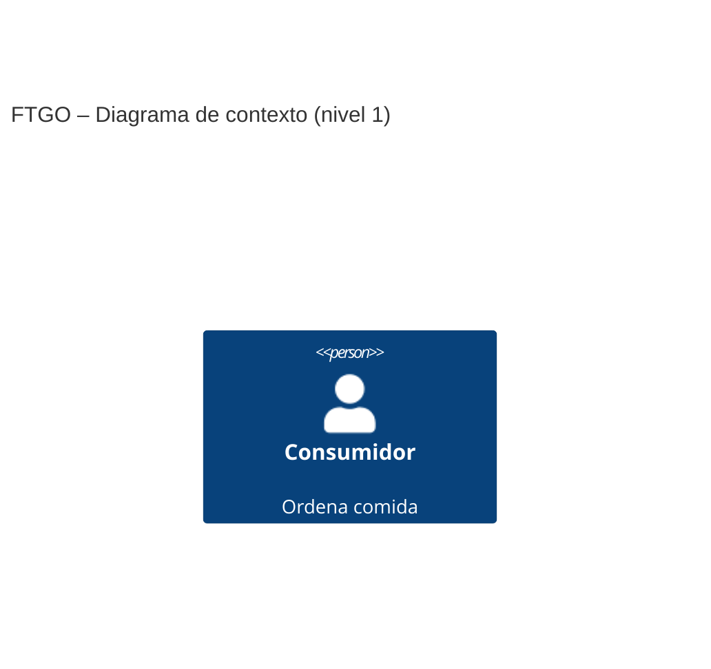
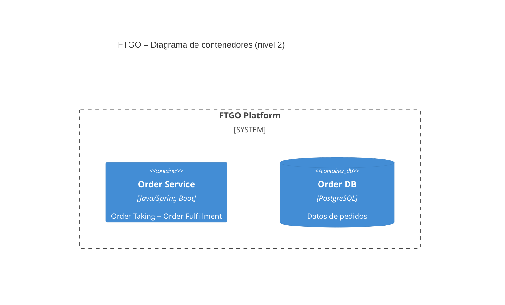
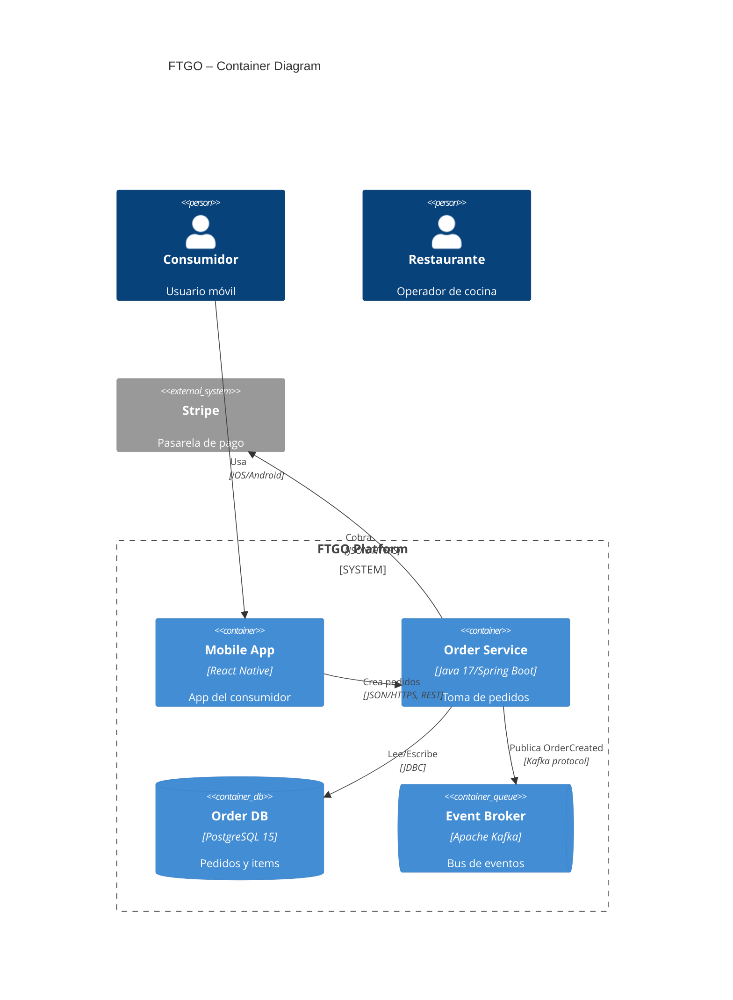

# B.4 Prompt semilla — Diagramas C4 (nivel 1 y 2) de FTGO

Tiene 4 huecos TODO marcados. Para mejorarlo aplica los 5 requisitos D4.

## Metadatos
| Campo | Valor |
| :--- | :--- |
| **ID** | PR-C4-FTGO-001 |
| **Artefacto destino** | 2 archivos .mmd (C4 nivel 1 y nivel 2) |
| **Modelo recomendado** | Sonnet / Opus |
| **Temperatura** | 0.2 |
| **Versión** | v0.1-seed |

## Role
Eres un arquitecto de software experto en el modelo C4 de Simon Brown y en la sintaxis Mermaid para C4Context y C4Container. Conoces el caso FTGO del libro de Richardson y has documentado al menos 10 sistemas usando C4.

## Task
Produce 2 diagramas Mermaid del caso FTGO:
1. `c4_context.mmd` — diagrama de contexto (nivel 1): FTGO como un solo sistema + personas + sistemas externos.
2. `c4_container.mmd` — diagrama de contenedores (nivel 2): los principales contenedores (microservicios, BDs, broker) de FTGO con sus tecnologías y protocolos.

## Context
- **Documentos fuente:**
  - `docs/prd.md` (stakeholders + capacidades + NFRs).
  - `docs/adr/0001-*.md` y `docs/adr/0002-*.md` (decisiones arquitectónicas que condicionan los containers).
  - el brief del Anexo A (sistemas externos, stakeholders).
- **TODO 1 (Context — sistema y stakeholders del brief):** enumera explícitamente el sistema principal y todas las personas/sistemas externos que deben aparecer en el diagrama de contexto. *Sin esta lista el diagrama omite externos clave del brief.*

## Reasoning
Sigue estos pasos en orden:
1. **Nivel 1 (Context):** dibuja FTGO como un único `System` rodeado de `Person` y `System_Ext`. Cada relación con un protocolo y un propósito (ej. "usa la app móvil para ordenar comida").
2. **Nivel 2 (Container):** dentro del `System_Boundary` de FTGO, dibuja los contenedores que se derivan del PRD y los ADRs (ej. Consumer Service, Order Service, Kitchen Service, Delivery Service, Billing Service, Notification Service, Mobile App, Web Admin, Order DB, Kafka Broker, etc.).
3. **TODO 2 (Reasoning — criterio nivel 1 vs nivel 2):** define aquí la regla para decidir qué pertenece al nivel 1 (Context) y qué al nivel 2 (Container).
4. En el Nivel 2, cada relación entre contenedores debe declarar tecnología + protocolo (ej. `<<JSON/HTTPS>>` o `<<async Kafka>>`).
5. Verifica que el Nivel 2 sea coherente con los ADRs (si elegiste async, el broker aparece; si elegiste DB-per-service, hay N BDs separadas).

## Stop condition
Detente cuando:
- Existen los 2 archivos Mermaid completos.
- Nivel 1: ≥ 1 Person, ≥ 2 System_Ext, 1 System (FTGO).
- Nivel 2: ≥ 5 contenedores, todas las relaciones con tecnología/protocolo.
- **TODO 3 (Stop condition — sintaxis válida):** agrega aquí un criterio para garantizar sintaxis Mermaid válida.
No continues produciendo contenido más allá de estas condiciones.

## Output
Formato: dos bloques de código Mermaid (uno por diagrama), cada uno destinado a un archivo `.mmd` separado.

**TODO 4 (Output — sintaxis Mermaid C4 detallada):** especifica aquí los elementos sintácticos exactos de Mermaid C4 que se deben usar y un fragmento de referencia más extenso.

*Sin un fragmento de referencia los maestrantes producen sintaxis inválida que no renderiza.*

## Invariants
- Ambos archivos deben ser sintaxis Mermaid C4 válida (C4Context, C4Container).
- Nivel 1 debe tener ≥ 1 Person y ≥ 2 System_Ext.
- Nivel 2 debe tener ≥ 5 contenedores.
- Cada relación de Nivel 2 debe declarar tecnología y protocolo.

## Failure modes
- `E_MISSING_INPUTS`: faltan PRD/ADRs → abortar.
- `E_INVALID_MERMAID`: la sintaxis no renderiza → reintentar.
- `E_LEVEL_MIXED`: el Nivel 1 contiene detalles internos de FTGO → reintentar.
- `E_NO_TECH_PROTOCOL`: hay relaciones sin tecnología/protocolo → reintentar.

## Huecos TODO del prompt C4
| # | Ubicación | Qué falta |
|---|---|---|
| **1** | Context | Lista concreta de personas y sistemas externos del brief |
| **2** | Reasoning | Regla para decidir Nivel 1 vs Nivel 2 |
| **3** | Stop condition | Criterio de sintaxis Mermaid válida |
| **4** | Output | Fragmento sintáctico de referencia más completo |

*Para considerarlo "mejorado": rellena ≥ 2 huecos + agrega 1 sección nueva + Changelog + comando en README + métrica con 3 corridas. Guarda en `prompts_enhanced/c4_enhanced.md`.*
