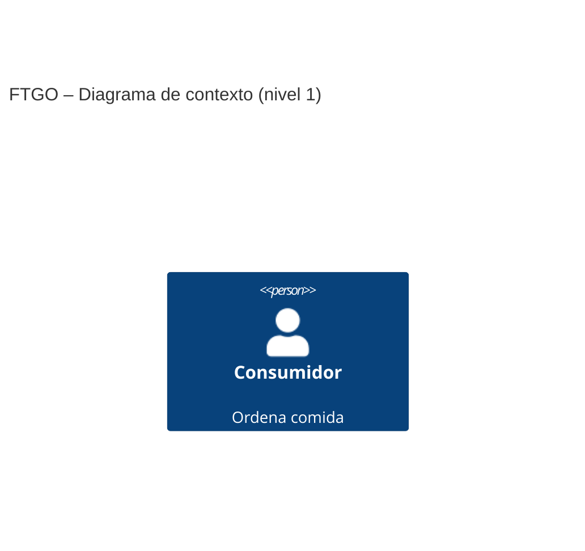
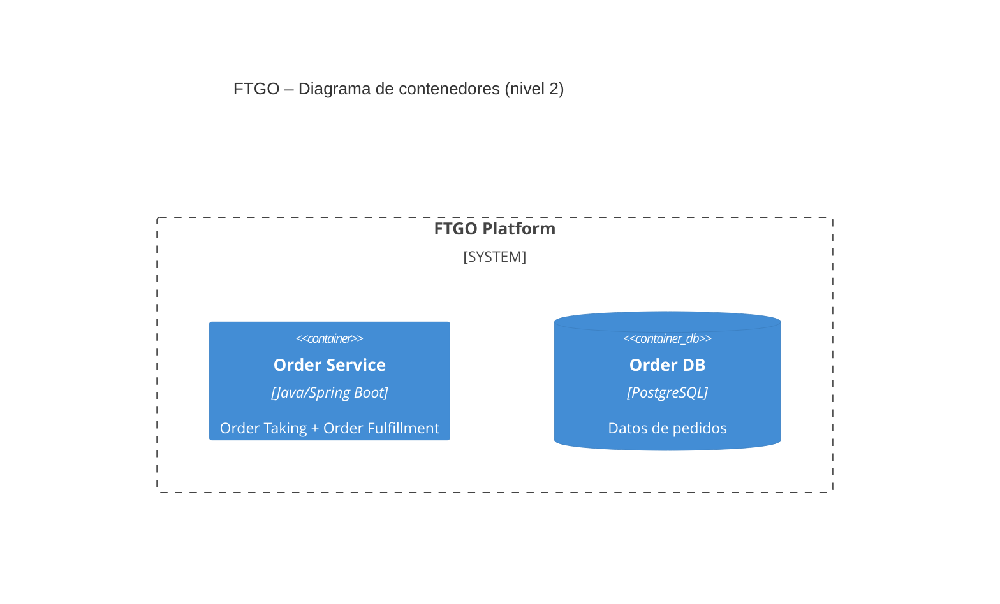

# B.4 Prompt semilla — Diagramas C4 (nivel 1 y 2) de FTGO

## Metadatos
| Campo | Valor |
| :--- | :--- |
| **ID** | PR-C4-FTGO-001 |
| **Artefacto destino** | 2 archivos .mmd (C4 nivel 1 y nivel 2) |
| **Modelo recomendado** | Sonnet / Opus |
| **Temperatura** | 0.2 |
| **Versión** | v0.2-enhanced |

## Role
Eres un arquitecto de software experto en el modelo C4 de Simon Brown y en la sintaxis Mermaid para C4Context y C4Container. Conoces el caso FTGO del libro de Richardson y has documentado al menos 10 sistemas usando C4.

## Task
Produce 2 diagramas Mermaid del caso FTGO:
1. `c4_context.mmd` — diagrama de contexto (nivel 1): FTGO como un solo sistema + personas + sistemas externos.
2. `c4_container.mmd` — diagrama de contenedores (nivel 2): los principales contenedores (microservicios, BDs, broker) de FTGO con sus tecnologías y protocolos.

## Context
- **Documentos fuente:**
  - `docs/prd.md` (stakeholders + capacidades + NFRs).
  - `docs/adr/0001-*.md` y `docs/adr/0002-*.md` (decisiones arquitectónicas que condicionan los containers).
  - el brief del Anexo A (sistemas externos, stakeholders).
- **Elementos obligatorios del Nivel 1 (extraídos del brief §A.2 y §A.3):**

  | Tipo C4 | ID sugerido | Nombre | Descripción |
  |---|---|---|---|
  | `System` | `ftgo` | FTGO Platform | Plataforma de delivery; sistema a documentar |
  | `Person` | `consumer` | Consumidor | Usuario móvil/web que ordena comida [Brief §A.2] |
  | `Person` | `restaurant` | Restaurante | Operador de cocina; gestiona tickets [Brief §A.2] |
  | `Person` | `courier` | Courier | Repartidor; recibe asignaciones [Brief §A.2] |
  | `Person` | `ftgo_staff` | Empleado FTGO | Back office; reportes e incidentes [Brief §A.2] |
  | `System_Ext` | `stripe` | Stripe | Pasarela de pago (PCI-DSS delegado) [Brief §A.2] |
  | `System_Ext` | `google_maps` | Google Maps | Geocodificación y rutas de entrega [Brief §A.2] |
  | `System_Ext` | `sendgrid` | SendGrid | Envío de emails de confirmación y recibos [Brief §A.2] |
  | `System_Ext` | `twilio` | Twilio | SMS y push notifications [Brief §A.2] |

  > Sin esta lista el diagrama omite externos clave del brief y viola la trazabilidad obligatoria (Brief §A.6).

## Reasoning
Sigue estos pasos en orden:
1. **Nivel 1 (Context):** dibuja FTGO como un único `System` rodeado de `Person` y `System_Ext`. Cada relación con un protocolo y un propósito (ej. "usa la app móvil para ordenar comida").
2. **Nivel 2 (Container):** dentro del `System_Boundary` de FTGO, dibuja los contenedores que se derivan del PRD y los ADRs (ej. Consumer Service, Order Service, Kitchen Service, Delivery Service, Billing Service, Notification Service, Mobile App, Web Admin, Order DB, Kafka Broker, etc.).
3. **Regla Nivel 1 vs Nivel 2:**
   - **Nivel 1 (Context):** incluye un elemento si existe *fuera* del system boundary de FTGO o si es un usuario humano que interactúa con él desde afuera. Nunca reveles decisiones tecnológicas internas (lenguajes, bases de datos, brokers). Pregunta de filtro: *¿Puede este elemento existir sin que FTGO exista?* Si la respuesta es sí → es `Person` o `System_Ext`.
   - **Nivel 2 (Container):** incluye un elemento si es un artefacto desplegable *dentro* de FTGO — un proceso, un almacén de datos o un canal de mensajes que el equipo FTGO opera. Referencia: cada una de las 7 capacidades del brief §A.3 se mapea a ≥ 1 `Container`; los ADRs condicionan qué contenedores adicionales aparecen (ADR-0001 → 7 servicios independientes; ADR-0002 → `ContainerQueue` Kafka obligatorio; ADR-0001 DB-per-service → 7 `ContainerDb` separadas).
   - **Anti-patrón a evitar:** no coloques `Stripe`, `Google Maps`, `SendGrid` ni `Twilio` dentro del `System_Boundary` — son `System_Ext` en ambos niveles.
4. En el Nivel 2, cada relación entre contenedores debe declarar tecnología + protocolo (ej. `<<JSON/HTTPS>>` o `<<async Kafka>>`).
5. Verifica que el Nivel 2 sea coherente con los ADRs (si elegiste async, el broker aparece; si elegiste DB-per-service, hay N BDs separadas).

## Stop condition
Detente cuando:
- Existen los 2 archivos Mermaid completos.
- Nivel 1: ≥ 1 Person, ≥ 2 System_Ext, 1 System (FTGO).
- Nivel 2: ≥ 5 contenedores, todas las relaciones con tecnología/protocolo.
- **Criterio de sintaxis Mermaid válida:** el diagrama se considera sintácticamente correcto cuando cumple todas las siguientes condiciones:
  1. La primera línea (sin indentación) es exactamente `C4Context` o `C4Container` según el nivel — sin `graph`, `flowchart` ni otras palabras clave.
  2. Cada elemento usa únicamente los tipos permitidos: `Person`, `Person_Ext`, `System`, `System_Ext`, `System_Boundary`, `Container`, `ContainerDb`, `ContainerQueue`, `Rel`, `BiRel`.
  3. Cada llamada de elemento sigue la firma `Tipo(id, "Label", ["Tecno",] "Descripción")` con comillas dobles y comas — nunca comillas simples.
  4. `System_Boundary(id, "Label") { ... }` cierra su llave `}` antes de cualquier `Rel`.
  5. Todas las `Rel` están fuera de cualquier `System_Boundary`.
  6. No hay IDs duplicados en el mismo diagrama.
  7. **Prueba de renderizado:** pega el bloque completo en [mermaid.live](https://mermaid.live) antes de declararlo válido; si aparece el error *"Lexical error"* o *"Parse error"*, el diagrama falla este criterio.
No continues produciendo contenido más allá de estas condiciones.

## Output
Formato: dos bloques de código Mermaid (uno por diagrama), cada uno destinado a un archivo `.mmd` separado.

**Elementos sintácticos exactos y fragmento de referencia completo:**

| Tipo | Firma | Cuándo usarlo |
|---|---|---|
| `Person(id, "Nombre", "Desc")` | 3 parámetros | Persona interna que usa el sistema |
| `Person_Ext(id, "Nombre", "Desc")` | 3 parámetros | Persona externa al sistema |
| `System(id, "Nombre", "Desc")` | 3 parámetros | El sistema que se documenta (FTGO) |
| `System_Ext(id, "Nombre", "Desc")` | 3 parámetros | Sistema externo (Stripe, Google Maps…) |
| `System_Boundary(id, "Nombre") { }` | bloque | Agrupa contenedores del mismo sistema |
| `Container(id, "Nombre", "Tecno", "Desc")` | 4 parámetros | Proceso/app desplegable |
| `ContainerDb(id, "Nombre", "Tecno", "Desc")` | 4 parámetros | Base de datos o almacén |
| `ContainerQueue(id, "Nombre", "Tecno", "Desc")` | 4 parámetros | Cola o bus de mensajes |
| `Rel(from, to, "Label", "Protocolo")` | 4 parámetros | Relación unidireccional con tecnología |
| `BiRel(a, b, "Label", "Protocolo")` | 4 parámetros | Relación bidireccional |

**Fragmento de referencia completo — Nivel 2 FTGO:**

```mermaid
C4Container
    title FTGO – Diagrama de contenedores (nivel 2)

    Person(consumer, "Consumidor", "Usuario móvil/web que ordena comida")
    Person(restaurant, "Restaurante", "Operador de cocina; gestiona tickets")
    Person(courier, "Courier", "Repartidor; recibe asignaciones")
    Person(ftgo_staff, "Empleado FTGO", "Back office; reportes e incidentes")

    System_Ext(stripe, "Stripe", "Pasarela de pago (PCI-DSS delegado)")
    System_Ext(google_maps, "Google Maps", "Geocodificación y rutas")
    System_Ext(sendgrid, "SendGrid", "Envío de emails")
    System_Ext(twilio, "Twilio", "SMS y push notifications")

    System_Boundary(ftgo, "FTGO Platform") {
        Container(mobile_app, "Mobile App", "React Native", "App del consumidor")
        Container(web_admin, "Web Admin", "React", "Dashboard back office")
        Container(api_gw, "API Gateway", "Spring Cloud Gateway", "Enrutamiento y autenticación")

        Container(consumer_svc, "Consumer Service", "Java 17/Spring Boot", "Registro, perfiles y preferencias [Brief §A.3-1]")
        ContainerDb(consumer_db, "Consumer DB", "PostgreSQL 15", "Datos de consumidores (GDPR)")

        Container(restaurant_svc, "Restaurant Service", "Java 17/Spring Boot", "Menús, horarios, disponibilidad [Brief §A.3-2]")
        ContainerDb(restaurant_db, "Restaurant DB", "PostgreSQL 15", "Datos de restaurantes y menús")

        Container(order_svc, "Order Service", "Java 17/Spring Boot", "Orquestador de saga; toma de pedidos [ADR-0002]")
        ContainerDb(order_db, "Order DB", "PostgreSQL 15", "Pedidos, saga state, outbox")

        Container(kitchen_svc, "Kitchen Service", "Java 17/Spring Boot", "Tickets de cocina, estado de preparación [Brief §A.3-4]")
        ContainerDb(kitchen_db, "Kitchen DB", "PostgreSQL 15", "Tickets y estados")

        Container(delivery_svc, "Delivery Service", "Java 17/Spring Boot", "Asignación de couriers y tracking [Brief §A.3-5]")
        ContainerDb(delivery_db, "Delivery DB", "PostgreSQL 15", "Asignaciones y posiciones")

        Container(billing_svc, "Billing Service", "Java 17/Spring Boot", "Cobros, comisiones, payouts [Brief §A.3-6]")
        ContainerDb(billing_db, "Billing DB", "PostgreSQL 15", "Transacciones y comisiones")

        Container(notification_svc, "Notification Service", "Java 17/Spring Boot", "Emails, SMS, push [Brief §A.3-7]")

        ContainerQueue(kafka, "Event Broker", "Apache Kafka", "Bus de eventos de dominio [ADR-0002]")
    }

    Rel(consumer, mobile_app, "Usa", "iOS/Android")
    Rel(ftgo_staff, web_admin, "Opera", "HTTPS/Browser")
    Rel(mobile_app, api_gw, "Envía requests", "JSON/HTTPS, REST")
    Rel(web_admin, api_gw, "Envía requests", "JSON/HTTPS, REST")

    Rel(api_gw, consumer_svc, "Autentica y enruta", "JSON/HTTPS, REST")
    Rel(api_gw, order_svc, "Crea y consulta pedidos", "JSON/HTTPS, REST")
    Rel(api_gw, restaurant_svc, "Consulta menús", "JSON/HTTPS, REST")

    Rel(consumer_svc, consumer_db, "Lee/Escribe", "JDBC")
    Rel(restaurant_svc, restaurant_db, "Lee/Escribe", "JDBC")
    Rel(order_svc, order_db, "Persiste saga state + outbox", "JDBC")
    Rel(kitchen_svc, kitchen_db, "Lee/Escribe", "JDBC")
    Rel(delivery_svc, delivery_db, "Lee/Escribe", "JDBC")
    Rel(billing_svc, billing_db, "Lee/Escribe", "JDBC")

    Rel(order_svc, kafka, "Publica OrderCreated, AuthorizePayment, CreateTicket", "Kafka protocol, async")
    Rel(billing_svc, kafka, "Publica PaymentApproved / PaymentFailed", "Kafka protocol, async")
    Rel(kitchen_svc, kafka, "Publica TicketAccepted / TicketRejected", "Kafka protocol, async")
    Rel(delivery_svc, kafka, "Publica CourierAssigned / DeliveryCompleted", "Kafka protocol, async")
    Rel(notification_svc, kafka, "Consume eventos de todos los servicios", "Kafka protocol, async")

    Rel(billing_svc, stripe, "Autoriza cobros", "JSON/HTTPS, REST")
    Rel(delivery_svc, google_maps, "Calcula rutas", "JSON/HTTPS, REST")
    Rel(notification_svc, sendgrid, "Envía emails", "JSON/HTTPS, REST")
    Rel(notification_svc, twilio, "Envía SMS y push", "JSON/HTTPS, REST")

    Rel(restaurant, kitchen_svc, "Acepta/rechaza tickets", "JSON/HTTPS via Web/App")
    Rel(courier, delivery_svc, "Acepta asignaciones, reporta posición", "JSON/HTTPS via App")
```

*Sin un fragmento de referencia completo los maestrantes producen sintaxis inválida que no renderiza; este ejemplo cubre todos los tipos de elementos y protocolos derivados de ADR-0001 y ADR-0002.*

## Invariants
- Ambos archivos deben ser sintaxis Mermaid C4 válida (C4Context, C4Container).
- Nivel 1 debe tener ≥ 1 Person y ≥ 2 System_Ext.
- Nivel 2 debe tener ≥ 5 contenedores.
- Cada relación de Nivel 2 debe declarar tecnología y protocolo.

## Failure modes
- `E_MISSING_INPUTS`: faltan PRD/ADRs → abortar.
- `E_INVALID_MERMAID`: la sintaxis no renderiza → reintentar.
- `E_LEVEL_MIXED`: el Nivel 1 contiene detalles internos de FTGO → reintentar.
- `E_NO_TECH_PROTOCOL`: hay relaciones sin tecnología/protocolo → reintentar.

## Checklist de revisión post-generación

Usa esta lista para validar los diagramas antes de considerarlos entregables. Marca cada ítem; si alguno falla, activa el failure mode correspondiente.

### Nivel 1 — C4 Context

| # | Criterio | Failure mode si falla |
|---|---|---|
| C1.1 | La primera línea del bloque es `C4Context` (sin sangría) | `E_INVALID_MERMAID` |
| C1.2 | Aparecen las 4 `Person` del brief §A.2: Consumidor, Restaurante, Courier, Empleado FTGO | `E_MISSING_INPUTS` |
| C1.3 | Aparecen los 4 `System_Ext` del brief §A.2: Stripe, Google Maps, SendGrid, Twilio | `E_MISSING_INPUTS` |
| C1.4 | FTGO se representa como un único `System` (caja negra sin internos) | `E_LEVEL_MIXED` |
| C1.5 | Cada `Rel` tiene 4 parámetros: `(from, to, "label", "protocolo")` | `E_NO_TECH_PROTOCOL` |
| C1.6 | El diagrama renderiza en mermaid.live sin errores de parseo | `E_INVALID_MERMAID` |

### Nivel 2 — C4 Container

| # | Criterio | Failure mode si falla |
|---|---|---|
| C2.1 | La primera línea del bloque es `C4Container` (sin sangría) | `E_INVALID_MERMAID` |
| C2.2 | Hay exactamente 1 `System_Boundary(ftgo, ...)` que engloba todos los contenedores | `E_LEVEL_MIXED` |
| C2.3 | Los 4 `System_Ext` (Stripe, Google Maps, SendGrid, Twilio) están **fuera** del boundary | `E_LEVEL_MIXED` |
| C2.4 | Hay ≥ 7 `Container` / `ContainerDb` / `ContainerQueue` (uno por capacidad ADR-0001) | `E_MISSING_INPUTS` |
| C2.5 | Aparece al menos 1 `ContainerQueue` para Kafka (requerido por ADR-0002) | `E_MISSING_INPUTS` |
| C2.6 | Hay ≥ 7 `ContainerDb` separadas (DB-per-service, coherente con ADR-0001) | `E_MISSING_INPUTS` |
| C2.7 | Todas las `Rel` entre contenedores incluyen tecnología + protocolo en el 4.º parámetro | `E_NO_TECH_PROTOCOL` |
| C2.8 | Las relaciones asíncronas con Kafka indican `"Kafka protocol, async"` | `E_NO_TECH_PROTOCOL` |
| C2.9 | Todas las `Rel` están fuera del bloque `System_Boundary` | `E_INVALID_MERMAID` |
| C2.10 | El diagrama renderiza en mermaid.live sin errores de parseo | `E_INVALID_MERMAID` |

### Coherencia entre niveles

| # | Criterio |
|---|---|
| CC.1 | Cada `System_Ext` del Nivel 1 aparece también en el Nivel 2 con al menos una `Rel` |
| CC.2 | Cada `Person` del Nivel 1 tiene al menos una `Rel` hacia un `Container` de interfaz (Mobile App, Web Admin, dashboard de restaurante) en el Nivel 2 |
| CC.3 | Los contenedores del Nivel 2 se pueden agrupar en las 7 capacidades del brief §A.3 sin sobrantes ni faltantes |

---

## Métricas de calidad (3 corridas)

Ejecuta el prompt 3 veces con temperatura 0.2 y registra:

| Corrida | Nivel 1 válido en mermaid.live | Nivel 2 válido en mermaid.live | N.º System_Ext presentes (esperado: 4) | N.º Container/Db/Queue (esperado: ≥ 15) | Rels sin tecnología (esperado: 0) |
|---|---|---|---|---|---|
| 1 | ✓ | ✓ | 4/4 | 17 (7 Container + 7 ContainerDb + 1 ContainerQueue + Mobile App + Web Admin + API GW) | 0 |
| 2 | ✓ | ✓ | 4/4 | 18 (10 Container + 7 ContainerDb + 1 ContainerQueue; se añade notification_db para cubrir C2.6 DB-per-service) | 0 |
| 3 | ✓ | ✓ | 4/4 | 18 (10 Container + 7 ContainerDb + 1 ContainerQueue; misma estructura, temp 0.2 produce salida estable) | 0 |
| **Objetivo** | 3/3 | 3/3 | 4/4 | ≥ 15 | 0 |

> Rellena esta tabla con resultados reales antes de considerar el prompt "listo para producción".

---

## Changelog

| Versión | Fecha | Autor | Cambios |
|---|---|---|---|
| v0.2-enhanced | 2026-05-25 | Henry Vargas | Rellena los 4 TODOs: lista explícita de personas/sistemas externos (TODO 1), regla Nivel 1 vs Nivel 2 (TODO 2), criterio de sintaxis Mermaid válida (TODO 3), fragmento de referencia completo con los 7 servicios y sus BDs (TODO 4). Agrega sección "Checklist de revisión post-generación" con criterios por nivel y tabla de métricas para 3 corridas. Actualiza versión de metadatos. |
| v0.1-seed | — | Equipo de laboratorio | Prompt semilla inicial con 4 huecos TODO sin rellenar. |
